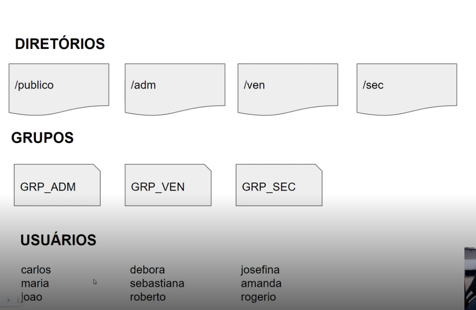

# create-users-bash-script
Um bash script que cria pastas, grupos e usuários e define as permissões de cada grupo.

## Esquema

Esta é a definição das pastas, grupos e usuários:

## Objetivo do script

- Criar os diretórios, grupos e usuários definidos no esquema;
- Todos os diretórios devem pertencer ao root;
- Todos devem ter permissão total no diretório 'publico';
- Todo usuário de determinado grupo deve ter permissão total em seu respectivo diretório;
- A senha deve ser criada pelo usuário no primeiro login;